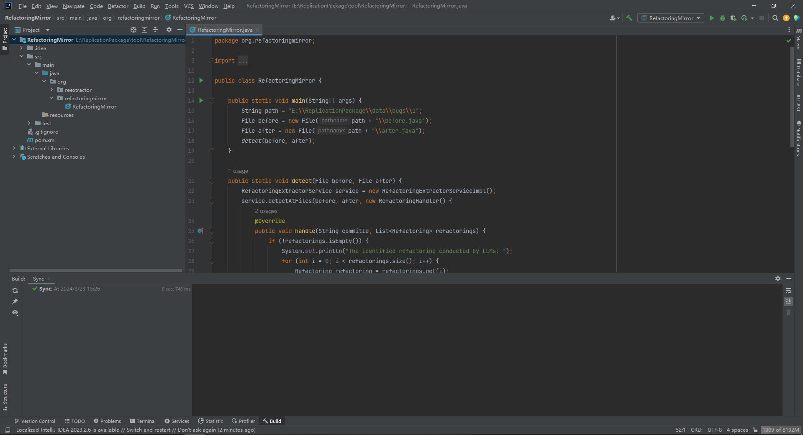
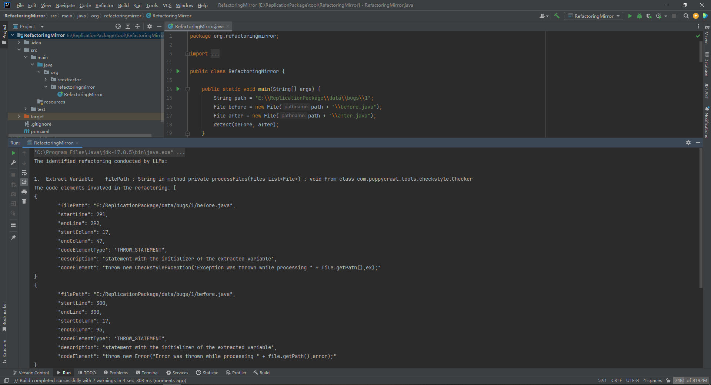

- # Table of Contents

  - [General Introduction](#general-introduction)
  - [Contents of the Replication Package](#contents-of-the-replication-package)
  - [Requirements](#requirements)
  - [Data](#data)
  - [Tool](#tool)
  - [Replication of Evaluation](#replication-of-evaluation)
  
  # General Introduction
  
  This is the replication package for TOSEM2024 submission, containing both the tool and the data that are requested by the replication. It also provides detailed instructions to replicate the evaluation.
  
  # Contents of the Replication Package
  
  /data: Input and output of the evaluation as well as the constructed refactoring dataset.
  
  /tool: Implementation of the proposed detect-and-reapply based bug mitigation (*RefactoringMirror*).
  
  # Requirements
  
  - Java 17.0.5 or newer
  - Apache Maven 3.8.6 or newer
  
  # Data
  
  ### 1. Dataset
  
  A new high-quality refactoring dataset comprising 180 real-world refactoring instances from 20 open-source Java projects.
  
  &emsp;**before.java**: the source code after reverse refactoring, i.e., the input of LLMs.
  
  &emsp;**after.java:** the ground truth constructed by the original developers, i.e., the expected output of LLMs.
  
  ### 2. Prompts
  
  Prompt templates tailored for nine different refactoring types to answer RQ1 and RQ2.
  
  Below you can find a sample prompt template:
  
  **Prompt 1 (P1):**
  
  ````
  As a developer, imagine your team leader requests you to review a piece of code to identify potential refactoring opportunities.
  The original code snippet is as follows:
  ```
  [original code]
  ```
  If there are any refactoring opportunities, please do it and generate the refactored code.
  Otherwise, simply state that no refactoring is necessary.
  ````
  
  ------
  
  **Prompt 2 (P2):**
  
  ````
  Rename method refactorings are frequently employed to modify low-quality identifiers to improve readability.
  As a developer, imagine your team leader requests you to review a piece of code to identify potential rename method refactoring opportunities.
  The original code snippet is as follows: 
  ```
  [original code]
  ```
  If there are any refactoring opportunities, please do it and generate the refactored code.
  Otherwise, simply state that no refactoring is necessary.
  ````
  
  ------
  
  **Prompt 3 (P3):**
  
  ````
  As a developer, imagine your team leader requests you to refactor a piece of code.
  The original code snippet is as follows: 
  ```
  [original code]
  ```
  Rename method refactorings are frequently employed to modify low-quality identifiers to improve readability.
  In the preceding code, there is a low-quality method name: [low-quality name]
  You may employ rename method refactorings to improve the preceding code and generate the refactored code.
  ````
  
  ### 3. Results
  
  All evaluation results in our empirical study are recorded in *evaluations.xlsx*:
  
  #### &emsp;Table Descriptions:
  
  &emsp;**Refactoring Type**: refactoring type to be evaluated  
  &emsp;**ID**: refactoring instance ID    
  &emsp;**Project Name**: name of the selected Java project    
  &emsp;**Commit SHA**: Git commit ID    
  &emsp;**LOC**: number of lines of source code    
  &emsp;**Validation**:  whether LLM identifies the refactoring opportunity    
  &emsp;&emsp;&emsp;&emsp;&emsp;&emsp; 0 - LLM does not identify the refactoring opportunity  
  &emsp;&emsp;&emsp;&emsp;&emsp;&emsp; 1 - LLM identifies the refactoring opportunity    
  &emsp;**Rating**: rating of LLM's refactoring solution    
  &emsp;&emsp;&emsp;&emsp;&emsp;&emsp; 4 (excellent) - better than developers    
  &emsp;&emsp;&emsp;&emsp;&emsp;&emsp; 3 (good) - comparable or identical to developers     
  &emsp;&emsp;&emsp;&emsp;&emsp;&emsp; 2 (poor) - inferior to developers     
  &emsp;&emsp;&emsp;&emsp;&emsp;&emsp; 1 (failed) - no refactoring at all   
  &emsp;&emsp;&emsp;&emsp;&emsp;&emsp; 0 (buggy) - resulting in functional changes or syntax errors
  
  ### 4. Taxonomy
  
  The 180 refactoring instances are assigned to 22 refactoring subcategories:
  
  **&emsp;Extract Class**: decomposition
  
  **&emsp;Extract Method**: decomposition; code duplication
  
  **&emsp;Extract Variable**: complex expression; code duplication
  
  **&emsp;Inline Method**: proxy method; single line statement; use only once
  
  **&emsp;Inline Variable**: use as reference; use only once
  
  **&emsp;Rename Attribute**: naming convention; attribute type; inconsistent context
  
  **&emsp;Rename Method**: inconsistent context; inconsistent method name
  
  **&emsp;Rename Parameter**: ambiguous semantic; parameter type; inconsistent context
  
  **&emsp;Rename Parameter**: naming convention; initialization; variable type; ambiguous semantic
  
  For a more detailed documentation, please refer to [taxonomy](data/taxonomy/README.md)
  
  ### 5. Bugs
  
  The refactoring solutions suggested by LLMs are unsafe in that they either change the functionality of the source code or introduce syntax errors.
  
  &emsp;**before.java**: the source code before refactoring, i.e., the input of LLMs.
  
  &emsp;**after.java:** the source code after refactoring, i.e., the output of LLMs.
  
  ### 6. Tests
  
  The 102 unit tests from the subject dataset (59) and generated by an automated unit test generation tool: [TestMe](https://github.com/wrdv/testme-idea) (43).
  
  # Tool
  
  RefactoringMirror: the implementation of the proposed detect-and-reapply based bug mitigation.
  
  **1. Clone replicate package to your local file system**
  
  `git clone https://github.com/RefactoringMirror/ReplicationPackage.git`
  
  **2. Import project**
  
  Go to *File* -> *Open...*
  
  Browse to the **tool/RefactoringMirror** directory
  
  Click *OK*
  
  The project will be built automatically.
  
  
  
  **3. Run RefactoringMirror**
  
  From the Project tab of IDEA navigate to `org.refactoringmirror.RefactoringMirror`
  
  Right-click on the file and select *Run RefactoringMirror.main()*
  
  
